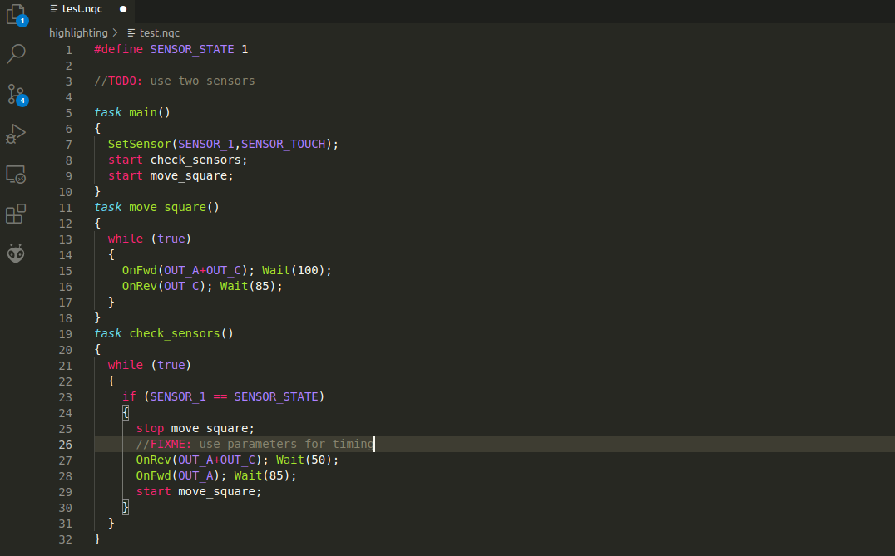

# NQC 

This is a very basic language package for the [NQC](http://bricxcc.sourceforge.net/nqc/) programming language.

Currently the package only supports highlighting, but no linting, or other advanced features. 

If you are interested in contributing I am happy to accept pull requests on [GitHub](https://github.com/nowaythatsok/nqc_vscode_extension).

